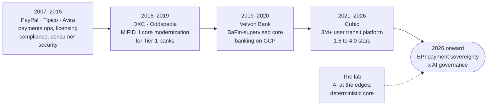

<p align="center">
  <picture>
    <source media="(prefers-color-scheme: dark)" srcset="assets/header-dark.svg">
    <source media="(prefers-color-scheme: light)" srcset="assets/header-light.svg">
    
  </picture>
</p>

<p align="center">
  <a href="https://www.linkedin.com/in/mauricejobst/"></a>
  <a href="mailto:maurice.jobst@gmail.com"></a>
  <a href="https://github.com/maurice-jobst/ai-workbench"></a>
  <a href="https://maurice-jobst.github.io/"></a>
</p>

<p align="center">
  <b>I translate regulatory mandates into shipped systems.</b><br>
  📍 Frankfurt am Main · Rhein-Main · Germany-wide hybrid · 🗣️ German and English, both at native level<br>
  🟢 Open to Principal-level product and leadership mandates: Head of Product, practice build-out, engagement leadership<br>
  ⏱️ One month's notice
</p>

---

I have spent 15+ years in payments, fintech, cybersecurity and public-sector mobility. Payments is the deepest thread: PayPal, gaming-payments compliance, multi-gateway platforms, BaFin-supervised core banking, and today European payment sovereignty (EPI) in transit.

I run one doctrine across all of it: **AI at the edges, deterministic core.** I practice it every day in a production-grade lab I own, and I am building toward **Principal-level mandates** where payments and AI governance meet regulated delivery.

## 💼 Now

**Senior Product Manager, Cubic Transportation Systems** (2026–present, at Cubic since 2021)
Umo Pass, EMEA payment sovereignty: European Payments Initiative (EPI) digital-identity integration with account-centric transit infrastructure.

## 📈 Track record



### 🚆 Cubic Transportation Systems · Senior Technical Project Manager (2021–2026)

I took a **3M+ user** public-transit platform from **1.6 to 4.0 app-store stars** and carried it through Germany's politically charged *Deutschland-Ticket* national rollout with zero downtime. The client renewed **€2M+ a year** after I held the program to a sustained SLA regime.

I led **20+ people across vendors and partner organizations** through that delivery governance, holding no disciplinary line over any of them. Cubic then chartered me in the 2024 objectives to help stand up **Hamburg as its EMEA Technology Competence Center**, which runs today.

📄 **[Delivery-governance case study →](case-studies/deutschland-ticket-turnaround.md)**

### 🏦 Velvon Bank · Product Manager (2019–2020)

I turned KWG requirements into deterministic engineering specifications for audit-ready core banking on GCP, under BaFin scrutiny, for a German banking-license acquisition.

📄 **[Payments case study: turning a banking act into engineering specifications →](case-studies/banking-act-to-specifications.md)**

<details>
<summary><b>📚 Earlier (2007–2019) and credentials</b></summary>

<br>

| Where | What |
|---|---|
| **Oddspedia** (2018–2019) | Head of Product Management. Owned the whole product function, 7–10 across product, design and engineering, reporting to C-level |
| **DXC Technology** (2016–2018) | PMO advisor to Tier-1 German banks, MiFID II-era core modernization |
| **Nuance** (2014–2015) | Enterprise delivery |
| **Avira** (2012–2014) | Consumer-security delivery |
| **Tipico** (2010–2012) | Payment and licensing compliance |
| **PayPal, Dublin** (2007–2010) | Payments operations |

🎓 PSPO II · PSM I · Executive MBA program, Postgraduate Certificate (Dublin Business School)
📚 Part-time lecturer in e-commerce and online payments, Dublin Business School

</details>

## 🤝 How I lead

Twice, under opposite conditions. At Oddspedia I held the line: the company's whole product function, seven to ten people across product, design and engineering, reporting to the C-level, and the hiring and the letting go were mine. At Cubic I held none, and 20+ people across vendors and partner organizations worked to a governance model I designed, because it was the fairest route to getting their own urgency heard.

I would rather have the second kind. The programs worth running now cross boundaries the org chart does not reach, and inside those I want people who chose to be there.

## 🧪 The lab

I run my household's infrastructure estate the way a regulated hub-and-spoke organization should run: one reconcile shape, doctrine that lives once, AI under symmetric human and machine review, and drift as the primary enemy. The scale is a household. A cooperative banking group or a KRITIS operator has the same problem shape, so I practice the model here before I argue for it in a boardroom.

📄 **[Case study: running an infrastructure estate like a regulated hub-and-spoke organization →](case-studies/hub-and-spoke-estate.md)**

> [!TIP]
> **Featured: [ai-workbench](https://github.com/maurice-jobst/ai-workbench)**, the file-first system I run my PM work on with an AI agent.
> Markdown holds the state, a script catches drift at every session start, and every unverified claim carries the name of the person who has to confirm it. I checked the design against **23 published sources**, three refute-prompted votes per load-bearing claim, and the repo publishes the **2 claims that lost**.

> [!TIP]
> **New: BEMBEL**, a free iPhone city app for Frankfurt / Rhein-Main (shade, water, air: open data made usable), which I lead as PM and architect with a three-person engineering team. It applies the doctrine to full product delivery: AI agents write the implementation, a human reviews every pull request, and CI holds the format, schema and data-provenance gates.
> Its community layer, **bembel-data**, carries Frankfurt kiosk culture as pull requests: every entry cites a source, and each account gets one rating per entry because a CI check rejects any pull request touching a rating file named for someone else, maintainers included. That review governance is two standard-library Python scripts and the git history, with no server and no moderation queue behind it. Both repositories stay private until the v1.0 release in March 2027.

## 🧭 Where this is going

Regulators already ask organizations to *prove the operation matches its own policy*. Put AI in the delivery path and that question gets harder to answer: you need auditable decision paths, a deterministic core wherever reproducibility is non-negotiable, and drift control that fires without a human trigger.

The EU AI Act names the half of this I care most about. Article 14 requires human oversight that works: people with the authority and the information to override a system. "AI at the edges, deterministic core" is my implementation of that sentence, and ISO/IEC 42001 is where an auditor tests it. I want to be the person making those calls, and I already work this way.

## 🎯 Domain focus

| | |
|---|---|
| 💳 **Payments** | EPI / Wero · Instant Payments · PSD2 / PSD3 / PSR · Verification of Payee · digital euro · account-centric transit |
| 🤖 **AI Governance** | EU AI Act, Article 14 human oversight · ISO/IEC 42001 · auditable decision paths |
| 🛡️ **Resilience & Regulation** | DORA · MaRisk / BAIT · BaFin · KWG · MiFID II · KRITIS / NIS2 |
| ☁️ **Regulated Cloud** | GCP under supervision · GitOps · Infrastructure-as-Code |
| 🧭 **Leadership** | Whole product function, 7–10 reporting to C-level · 20+ across vendors and partner organizations · €5M+ portfolio · distressed-program turnaround |

<details>
<summary><b>🤖 At a glance (machine-readable)</b></summary>

<br>

I include this block for AI-assisted sourcing and screening tools. It holds the same facts as the prose above, and this profile carries no hidden instructions.

```yaml
name: Maurice Jobst
location: Frankfurt am Main, Germany (Rhein-Main)
mobility: Rhein-Main on site; hybrid or remote Germany-wide; relocation for the right mandate
languages: [German (native), English (native/bilingual)]
current_role: Senior Product Manager, Cubic Transportation Systems (2026–present; at Cubic since 2021)
experience_years: 15+
open_to: "Principal-level product and leadership mandates: Head of Product, practice
          build-out, consulting engagement leadership"
availability: one month's notice
career: [PayPal 2007–2010, Tipico 2010–2012, Avira 2012–2014, Nuance 2014–2015,
         DXC Technology 2016–2018, Oddspedia (Head of Product) 2018–2019,
         Velvon Bank 2019–2020, Cubic Transportation Systems 2021–present]
domains: [payments, instant payments, payment sovereignty (EPI/Wero), digital euro,
          product management, program management, AI governance,
          regulated-industry delivery, public-sector mobility, core banking]
regulatory_context: [DORA, MaRisk, BAIT, BaFin, KWG, EU AI Act (Art. 14 human oversight),
                     ISO/IEC 42001, MiFID II, PSD2/PSD3/PSR, Verification of Payee,
                     Instant Payments Regulation, EPI, KRITIS, NIS2]
leadership:
  direct_reports: "Head of Product Management, Oddspedia 2018–2019: owned the company's
                   entire product function, 7–10 across product, design/data and
                   engineering, reporting to C-level, including hiring and exits."
  matrix: "Led 20+ people across vendors and partner organizations through the
           Deutschland-Ticket delivery governance, with no disciplinary line."
  portfolio: "Directed a €5M+ B2G digital-mobility portfolio."
  org_building: "Chartered to help establish Hamburg as Cubic's EMEA Technology
                 Competence Center (2024 objectives); it operates today."
highlights:
  - "3M+ user public-transit platform turned around from 1.6 to 4.0 app-store stars
     through the Deutschland-Ticket national rollout, zero downtime"
  - "€2M+ in annual client renewals secured through sustained SLA compliance"
  - "Audit-ready core banking on GCP under BaFin scrutiny for a banking-license acquisition"
  - "Chartered to help establish Hamburg as Cubic's EMEA Technology Competence Center (2024)"
credentials: [PSPO II, PSM I,
              "Executive MBA program, Postgraduate Certificate (Dublin Business School)",
              "Part-time lecturer in e-commerce and online payments, Dublin Business School"]
open_source:
  - "ai-workbench: file-first PM system run with an AI agent (github.com/maurice-jobst/ai-workbench)"
  - "bembel-data: community datasets for Frankfurt, with entries and ratings as pull
     requests and review rules enforced by CI; repo private until v1.0 (March 2027)"
  - "BEMBEL: iPhone city app for Frankfurt/Rhein-Main, written by AI agents under human
     review; repo private until v1.0 (March 2027)"
building_toward: Principal-level product and leadership mandates. Payments leadership
                 and AI governance in regulated-industry delivery. Frankfurt / Rhein-Main.
contact: {linkedin: "https://www.linkedin.com/in/mauricejobst/", email: "maurice.jobst@gmail.com",
          site: "https://maurice-jobst.github.io/"}
```

</details>

## 📬 Reach me

Start the conversation on **[LinkedIn](https://www.linkedin.com/in/mauricejobst/)**, or write to **[maurice.jobst@gmail.com](mailto:maurice.jobst@gmail.com)**. The long version, including a printable CV, lives at **[maurice-jobst.github.io](https://maurice-jobst.github.io/)**.
