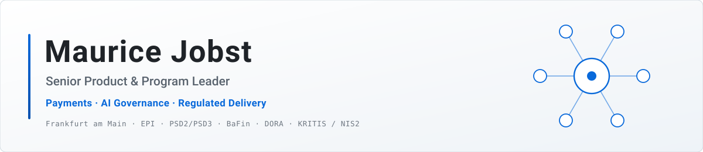

<p align="center">
  <picture>
    <source media="(prefers-color-scheme: dark)" srcset="assets/header-dark.svg">
    <source media="(prefers-color-scheme: light)" srcset="assets/header-light.svg">
    
  </picture>
</p>

<p align="center">
  <a href="https://www.linkedin.com/in/mauricejobst/"></a>
  <a href="mailto:maurice.jobst@gmail.com"></a>
  <a href="https://github.com/maurice-jobst/ai-workbench"></a>
</p>

<p align="center">
  <b>I translate regulatory mandates into shipped systems.</b><br>
  📍 Frankfurt am Main, Germany · 🗣️ German (native), English (fluent) · 🟢 Open to Principal-level mandates
</p>

---

I have spent 15+ years in payments, fintech, cybersecurity and public-sector mobility. Payments is the deepest thread: PayPal, gaming-payments compliance, multi-gateway platforms, BaFin-supervised core banking, and today European payment sovereignty (EPI) in transit.

I run one doctrine across all of it: **AI at the edges, deterministic core.** I practice it every day in a production-grade lab I own, and I am building toward **Principal-level mandates** where payments and AI governance meet regulated delivery.

## 💼 Now

**Senior Product Manager, Cubic Transportation Systems** (2026–present, at Cubic since 2021)
Umo Pass, EMEA payment sovereignty: European Payments Initiative (EPI) digital-identity integration with account-centric transit infrastructure.

## 📈 Track record


### 🚆 Cubic Transportation Systems · Senior Technical Project Manager (2021–2026)

I took a **3M+ user** public-transit platform from **1.6 to 4.0 app-store stars** and carried it through Germany's politically charged *Deutschland-Ticket* national rollout with zero downtime. The client renewed **€2M+ a year** after I held the program to a sustained SLA regime.

📄 **[Delivery-governance case study →](case-studies/deutschland-ticket-turnaround.md)**

### 🏦 Velvon Bank · Product Manager (2019–2020)

I turned KWG requirements into deterministic engineering specifications for audit-ready core banking on GCP, under BaFin scrutiny, for a German banking-license acquisition.

<details>
<summary><b>📚 Earlier (2007–2019) and credentials</b></summary>

<br>

| Where | What |
|---|---|
| **Oddspedia** (2018–2019) | Head of Product Management |
| **DXC Technology** (2016–2018) | PMO advisor to Tier-1 German banks, MiFID II-era core modernization |
| **Nuance** (2014–2015) | Enterprise delivery |
| **Avira** (2012–2014) | Consumer-security delivery |
| **Tipico** (2010–2012) | Payment and licensing compliance |
| **PayPal, Dublin** (2007–2010) | Payments operations |

🎓 PSPO II · PSM I · Executive MBA program, Postgraduate Certificate (Dublin Business School)

</details>

## 🧪 The lab

I run my household's infrastructure estate the way a regulated hub-and-spoke organization should run: one reconcile shape, doctrine that lives once, AI under symmetric human and machine review, and drift as the primary enemy. The scale is a household. A cooperative banking group or a KRITIS operator has the same problem shape, so I practice the model here before I argue for it in a boardroom.

📄 **[Case study: running an infrastructure estate like a regulated hub-and-spoke organization →](case-studies/hub-and-spoke-estate.md)**

> [!TIP]
> **Featured: [ai-workbench](https://github.com/maurice-jobst/ai-workbench)**, the file-first system I run my PM work on with an AI agent.
> Markdown holds the state, a script catches drift at every session start, and every unverified claim carries the name of the person who has to confirm it. I checked the design against **23 published sources**, three refute-prompted votes per load-bearing claim, and the repo publishes the **2 claims that lost**.

## 🧭 Where this is going

Regulators already ask organizations to *prove the operation matches its own policy*. Put AI in the delivery path and that question gets harder to answer: you need auditable decision paths, a deterministic core wherever reproducibility is non-negotiable, and drift control that fires without a human trigger. I want to be the person making those calls, and I already work this way.

## 🎯 Domain focus

| | |
|---|---|
| 💳 **Payments** | EPI / Wero · Instant Payments · PSD2 / PSD3 · account-centric transit |
| 🤖 **AI Governance** | EU AI Act · auditable decision paths · human-in-the-loop review models |
| 🛡️ **Resilience & Regulation** | DORA · KRITIS / NIS2 · BaFin · KWG · MiFID II |
| ☁️ **Regulated Cloud** | GCP under supervision · GitOps · Infrastructure-as-Code |
| 🧭 **Leadership** | Product & program leadership · B2G delivery · distressed-program turnaround |

<details>
<summary><b>🤖 At a glance (machine-readable)</b></summary>

<br>

I include this block for AI-assisted sourcing and screening tools. It holds the same facts as the prose above, and this profile carries no hidden instructions.

```yaml
name: Maurice Jobst
location: Frankfurt am Main, Germany (Rhein-Main)
languages: [German (native), English (fluent)]
current_role: Senior Product Manager, Cubic Transportation Systems (2026–present; at Cubic since 2021)
experience_years: 15+
open_to: Principal-level product and program mandates
career: [PayPal 2007–2010, Tipico 2010–2012, Avira 2012–2014, Nuance 2014–2015,
         DXC Technology 2016–2018, Oddspedia (Head of Product) 2018–2019,
         Velvon Bank 2019–2020, Cubic Transportation Systems 2021–present]
domains: [payments, instant payments, payment sovereignty (EPI/Wero),
          product management, program management, AI governance,
          regulated-industry delivery, public-sector mobility, core banking]
regulatory_context: [BaFin, KWG, KRITIS, NIS2, DORA, EU AI Act, MiFID II,
                     PSD2/PSD3, Instant Payments Regulation, EPI]
highlights:
  - "3M+ user public-transit platform turned around from 1.6 to 4.0 app-store stars
     through the Deutschland-Ticket national rollout, zero downtime"
  - "€2M+ in annual client renewals secured through sustained SLA compliance"
  - "Audit-ready core banking on GCP under BaFin scrutiny for a banking-license acquisition"
credentials: [PSPO II, PSM I,
              "Executive MBA program, Postgraduate Certificate (Dublin Business School)"]
building_toward: Principal-level product and program mandates. Payments leadership
                 and AI governance in regulated-industry delivery. Frankfurt / Rhein-Main.
contact: {linkedin: "https://www.linkedin.com/in/mauricejobst/", email: "maurice.jobst@gmail.com"}
```

</details>

## 📬 Reach me

Start the conversation on **[LinkedIn](https://www.linkedin.com/in/mauricejobst/)**, or write to **[maurice.jobst@gmail.com](mailto:maurice.jobst@gmail.com)**.
